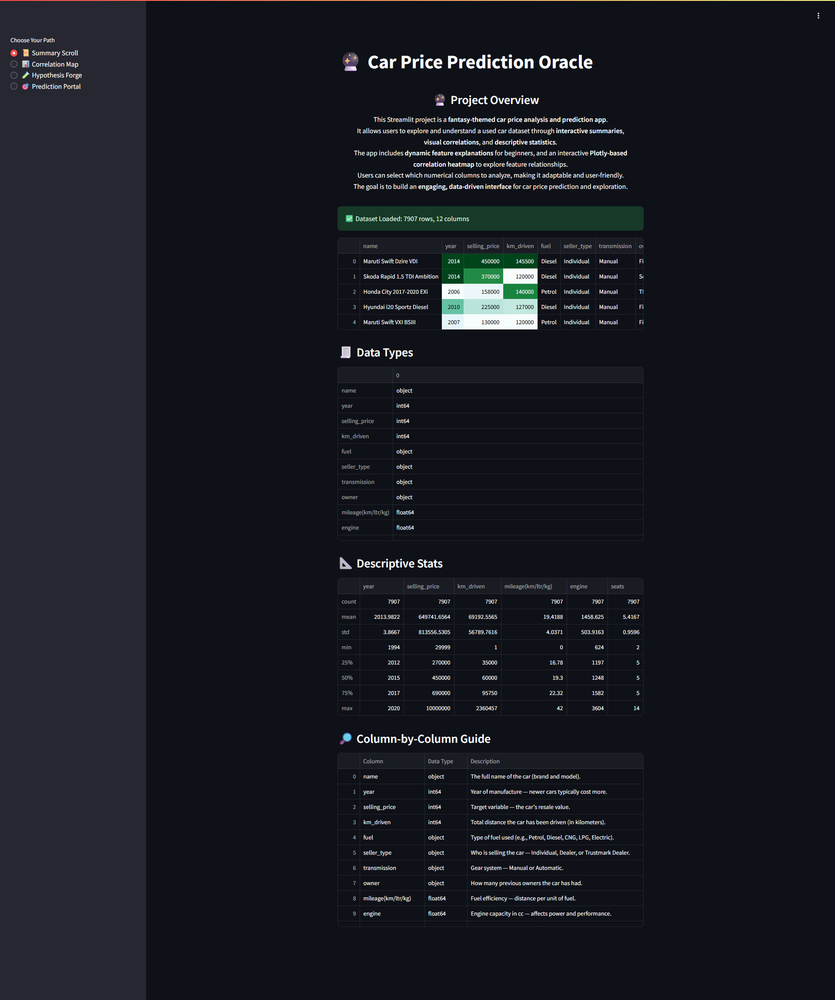
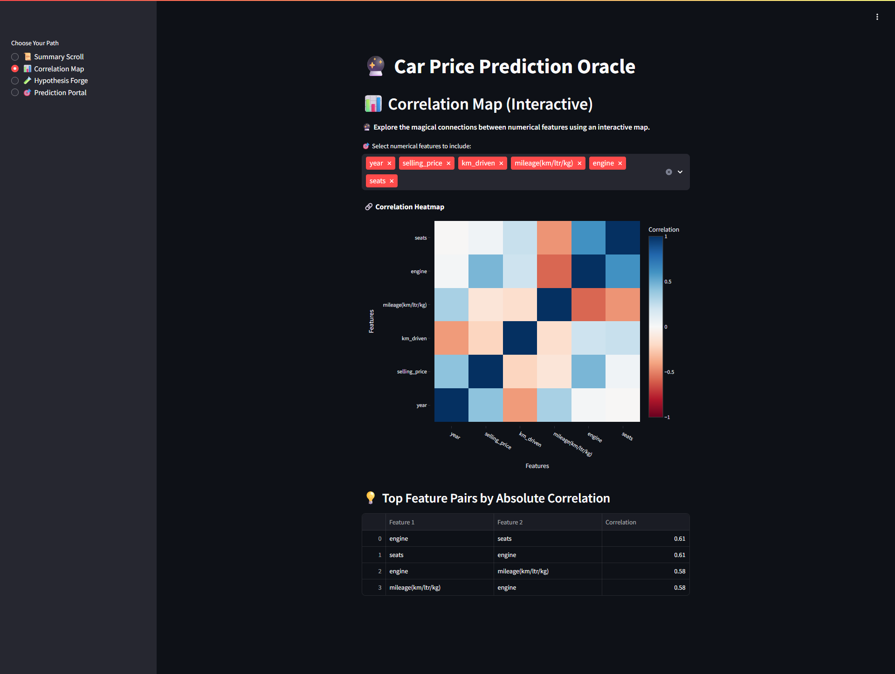
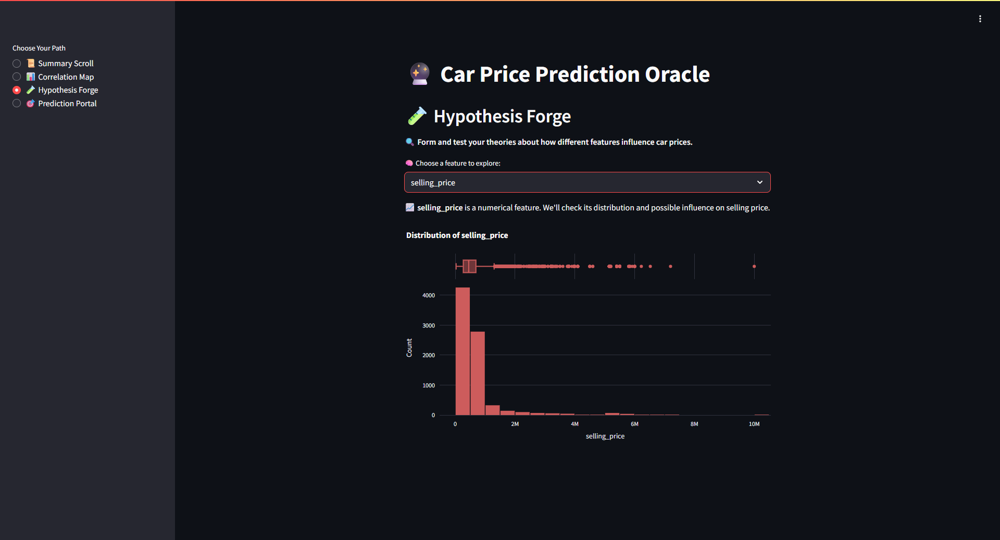
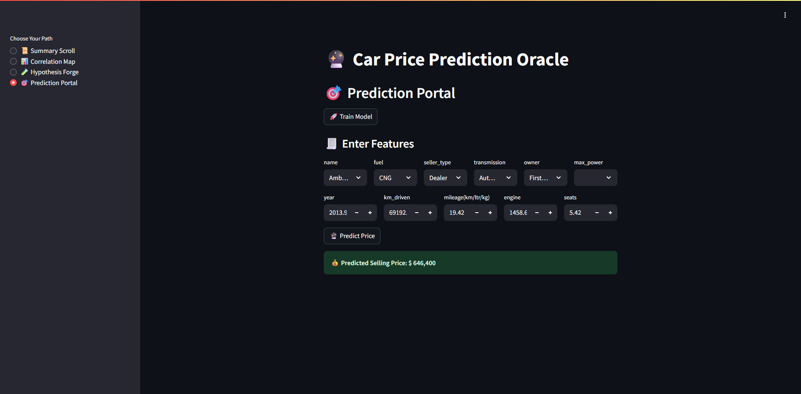

# Car Price Prediction App

 [Car Price Prediction](https://car-price-predicition.onrender.com) is a web-based application developed using **Streamlit** that predicts the price of used cars based on several features. It includes data preprocessing, exploratory data analysis, feature selection, hypothesis testing, and model deployment. The app is modularized into multiple pages for better usability and analysis workflow.

---
## 📌 Table of Contents

- [Project Overview](#project-overview)
- [Workflow](#workflow)
- [Pages of Streamlit](#pages-of-streamlit)
- [Technologies Used](#technologies-used)
- [Model and Preprocessing](#model-and-preprocessing)
- [Streamlit Caching](#streamlit-caching)
- [How to Run Locally](#how-to-run-locally)
- [Project Structure](#project-structure)
- [Credits](#credits)

---

## 🧾 Project Overview

This Car Price Prediction App allows users to:

- Understand the structure and insights of the dataset.
- Explore correlations among variables.
- Perform hypothesis tests to see how features relate to the selling price.
- Input custom vehicle parameters and predict the car's price using a trained machine learning model.

The target variable is **`selling_price`**, and the model is trained on cleaned and preprocessed data derived from an original used car dataset.

---

## 🔄 Workflow

The complete data and model pipeline follow this sequence:

1. **Data Collection**  
   - Raw data is loaded from CSV files located in the `datasets/` directory.

2. **Data Cleaning & Feature Engineering**  
   - Done in Jupyter notebooks located in `jupyter_notebooks/`.
   - Includes handling missing values, converting categorical variables, and feature extraction.

3. **Exploratory Data Analysis (EDA)**  
   - Includes distribution analysis, correlation matrix, and boxplots to detect outliers.

4. **Hypothesis Testing**  
   - Users interactively test how specific features (e.g., year, fuel type) influence price.

5. **Model Training**  
   - `RandomForestRegressor` from scikit-learn is used for training.
   - Trained on processed features with optimal hyperparameters.

6. **Deployment**  
   - Final model is integrated into Streamlit using a multi-page architecture.

---

## ⚙️ Pages of Streamlit

### 1. Summary Page
- **Purpose:** Gives a high-level overview of the dataset.
- **Details:** Displays the structure of the dataset including column names, data types, null values, and a statistical summary (mean, median, standard deviation, etc.).
- **Screenshot:**
  
  

---

### 2. Correlation Page
- **Purpose:** Helps understand relationships between numerical features.
- **Details:** Shows a correlation heatmap to identify multicollinearity or strongly related predictors.
- **Screenshot:**
  
  

---

### 3. Hypothesis Testing Page
- **Purpose:** Analyze how selected features relate to the target variable.
- **Details:** Lets users select categorical or continuous variables to compare against the target using violin plots, bar charts, and strip plots.
- **Screenshot:**
  
  

---

### 4. Prediction Page
- **Purpose:** Predict car prices based on user input.
- **Details:** Takes input values for key features, runs them through a pre-trained model, and returns the predicted price.
- **Screenshot:**
  
  


## 📊 Model and Preprocessing

### 🎯 Target Variable
- `selling_price` (continuous numerical value)

### 🧠 Model Used
- **Random Forest Regressor**
  - Chosen for its robustness to outliers, ability to handle mixed data types, and high accuracy without heavy parameter tuning.

### ⚙️ Preprocessing Steps
- Encoding categorical variables (`OneHotEncoder`, `LabelEncoder`)
- Scaling numerical variables (where required)
- Handling null values and data type conversions
- Saving the final processed dataset (`car_dataset_cleaned.csv`)

### 🧾 Model Integration
- Model is trained in a Jupyter notebook and saved using `joblib`.
- Loaded in the prediction page using Streamlit's cache mechanism for performance.

---


## 🧠 Streamlit Caching

```python
@st.cache_resource
def get_pipeline(cat_cols):
    preprocessor = ColumnTransformer([
        ('cat', OneHotEncoder(handle_unknown='ignore'), cat_cols)
    ], remainder='passthrough')

    model = Pipeline([
        ('preprocess', preprocessor),
        ('regressor', RandomForestRegressor(random_state=42))
    ])
    return model
````

| Cache Type           | Purpose                       | Used For         |
| -------------------- | ----------------------------- | ---------------- |
| `@st.cache_data`     | Avoid re-reading CSVs         | `load_data()`    |
| `@st.cache_resource` | Avoid re-building ML pipeline | `get_pipeline()` |

---


## 💻 How to Run Locally

### 📦 Install Requirements

```bash
pip install -r requirements.txt
```

### ▶️ Run Streamlit App

```bash
streamlit run app.py
```

✅ Ensure you are in the project directory before running the above command.

---


## 🗂️ Project Structure

```bash
car-price-prediction/
│
├── app.py                   # Main Streamlit app entry point
├── multipage.py             # Handles multiple pages in Streamlit
│
├── app_pages/               # All app pages
│   ├── summary.py
│   ├── correlation.py
│   ├── hypothesis.py
│   └── prediction.py
│
├── datasets/
│   ├── car_dataset.csv
│   └── car_dataset_cleaned.csv
│
├── jupyter_notebooks/
│   ├── 1_data_collection.ipynb
│   ├── 2_data_cleaning.ipynb
│   └── 3_model_training.ipynb
|
├── docs/
│   ├── screenshots
│   ├── plots
|
├── requirements.txt
├── runtime.txt
├── setup.sh
├── README.md
└── .gitignore
```
## ** Credits**
 
### **Code**

- I have reused and adapted code from different sections of the course as well as the walk through projects.

- Specific locations of the sources of the code are referred to in inline comments and doc strings in each notebook or python file.

 
### **Content**

- Emojis used in this project are sourced from [Emojipedia](https://emojipedia.org/). All rights belong to their respective creators.


- Dataset taken from [Kaggle](https://www.kaggle.com/datasets/sukhmandeepsinghbrar/car-price-prediction-dataset).


### **Acknowledgements**

* I would like to thank my mentor, Mo Shami, for his kind support and inspiring comments.
